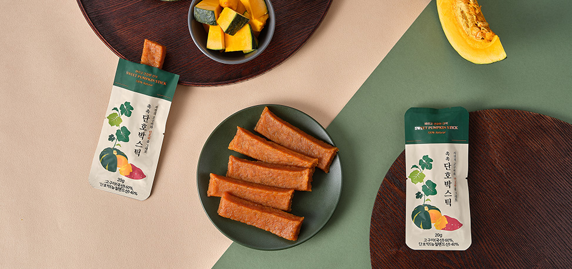
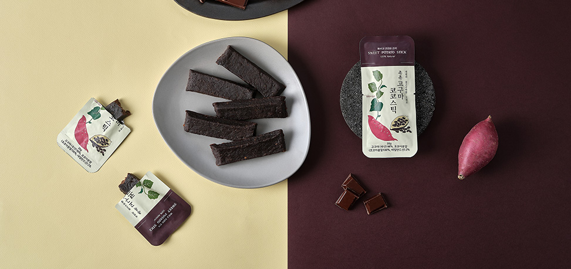

# hanwool_project 24.06.10 ~ 24.06.19
## 한울 반응형 웹페이지 클론코딩(컨버팅)
### 결과 링크 바로가기
https://hanwool.netlify.app/<br>
http://eey1741.dothome.co.kr/project_hanwool/index.html
### 기존 웹페이지 바로가기
http://www.deli-hanwool.com/
## 📋 기존 웹페이지 분석
## 1) Main Page
### 전반적인 공통 구성
* swiper slide 플러그인을 사용하여 여러 이미지를 차례로 보여주는 구성
* 페이지 스크롤 할때마다 이미지가 동적 애니메이션으로 등장함(Scroll Trigger)
* 메인 제목 폰트 동일 `Shrikhand`, 기본 폰트 `Noto Sans KR`
* 메인 컬러 `#013630`, 서브(배경)컬러 `#F7F5E8`
### 1. 헤더 (Header)
#### (데스크탑)
>* 메인로고 + 메인로고 + nav + sidenav
>* 각 nav메뉴에 올렸을 때 해당 서브메뉴가 나옴
>* 사이드바 클릭 시 오른쪽에서 nav메뉴가 크게 나타남
>* 사이드바 내 nav메뉴 하단에는 주소와 sns 링크 배치되어있음
#### (모바일)
>* nav 사라지고 오른쪽 사이드바가 모바일 nav로 변경됨
>* 모바일 nav 아이콘으로 변경되며, 로고의 크기 줄어듦
>* 모바일 nav 클릭 시 nav메뉴가 등장하며, 클릭한 nav메뉴의 sub만 보여짐
### 2-1. 메인페이지 Present
#### (데스크탑)
>* 브랜드 상품이미지와 함께 브랜드 컨셉을 설명하고 있음
>* swiper slide 기능을 활용하여 이미지를 보여줌
#### (모바일)
>* 왼쪽 이미지 사라지고, slide형식의 이미지가 full로 화면에 배열되어 보여짐
### 2-2. 메인페이지 Brand
#### (데스크탑)
>* 자유로운 이미지 배치 레이아웃을 보여주고 있음
>* 두 개의 이미지에는 링크 연결되어있음
#### (모바일)
>* 왼쪽이미지가 먼저 사라지고, width가 더 줄어들면 제목 및 두 개의 이미지(링크포함)가 세로로 배열되어 보여짐
### 2-3. 메인페이지 Product
#### (데스크탑)
>* 그리드 형식으로 상품이미지를 배치하였음
>* swiper slide 형식으로 상품이미지를 차례로 보여줌
#### (모바일)
>* 왼쪽이미지가 먼저 사라지고, width가 더 줄어들면 제목 및 두 개의 이미지(링크포함)가 세로로 배열되어 보여짐
### 2-4. 메인페이지 Product
#### (데스크탑)
>* 그리드 형식으로 상품이미지를 배치하였음
>* swiper slide 형식으로 상품이미지를 차례로 보여줌
>* 그리드 아래 오른쪽 글 또한 swiper slide 사용
#### (모바일)
>* 그리드 배열이 달라짐 : (상품) 3->2 / (상담 및 스토리) 그리드비율 1:1 -> 2:1 -> 1:1(세로 배치)
### 2-5. 메인페이지 Overlap-link
#### (데스크탑)
>* 겹쳐진 3개의 링크를 개별로 mouseover 시 해당 링크박스가 등장 및 컬러가 반전되어 보여짐
>* 링크박스 내 개체들이 애니메이션으로 움직임
>* 상품문의 링크는 다른 박스와 달리 배경이미지와 함께 크게 배너형식으로 보여지는 디자인
>* 상품문의 mouseover 시 글자 내 배경이 채워지는 효과가 나타남
#### (모바일)
>* 겹쳐진 형태에서 링크박스가 차례대로 배치되는 것으로 변경됨
>* mouseover 시 해당 링크박스 내 개체들이 애니메이션으로 움직임
### 3. 푸터(Footer)
#### (데스크탑)
>* 크게 가로로 3개의 영역에서 정보 배치되어있음
>* 기업 브랜드 로고 및 sns 링크 연결버튼 있음
#### (모바일)
>* 정보 배열이 세로로 변경됨
>* 모바일 전용 통화 버튼이 생김
>* 기업 브랜드 로고 사라짐
## 2) Sub Page
### 전반적인 공통 구성
* 메인 제목 + 서브 카테고리 + 콘텐츠 배치의 레이아웃으로 구성됨
* 한울소개 페이지 외에 모두 검색 form 활성화되어있음
* 모바일로 변경 시 서브 카테고리 사라짐
* **모바일 크기로 줄였을 때 검색창의 넓이가 애매해지는 문제 발생**
### 1. 한울소개
>* 제목 + 이미지 + 내용 순으로 브랜드 스토리 설명
### 2. 제품소개
>* 제품 카테고리 상단 배치 및 4개의 열로 상품이 나열되어있음
>* (반응형) 상품 가로열이 4 > 3 > 2 순으로 줄어듦
### 3. 한울인증
>* 특허인증이미지가 4개의 열로 나열되어있음
>* (반응형) 이미지 가로열이 4 > 3 으로 줄어듦
### 4. 커뮤니티
>* 사진과 제목+내용을 가로로 배치
>* **(반응형) 사진과 글 배치의 비율이 애매해지는 문제 발생**
### 5. 고객지원
>* 질문+답변 형식으로 배치되어있음
>* 첫 질문만 답변 처음에 보여짐
>* 토글 형식으로 답변을 보이거나 숨길 수 있음
>* 한울소개>상담문의 페이지로 갈 수 있도록 링크태그로 따로 작성할 필요가 있음. 현재 텍스트로 작성되어있음
>* **답변을 열었을 때 하단 footer까지 내려가지 못하는 문제 발생**
## 💡 기존 웹페이지에서 개선한 점
* 콘텐츠 간의 여백을 균등하게 조정하여 **레이아웃의 일관성**을 높였다.
* 사이드바 내 하단에 있는 **SNS링크에 아이콘 삽입 및 디자인을 수정**하여 한 눈에 보기 편하도록 수정하였다.
* 서브페이지에 있는 **검색창의 크기**를 모바일로 변경 시 **화면의 full-width**로 변경하였다.
* 서브페이지(커뮤니티)에서 모바일로 변경 시 **사진+글 배치를 세로로 변경**하여 애매한 레이아웃의 불편함을 개선하였다.
## 📃 작업 과정 및 어려웠던 점
## 24.06.10
### 와이어프레임 & 프로토타입 디자인 (2시간 소요)
* Desktop 1920px-margin 165px, mobile 780px-margin 18px로 설정
* hover/click 활성화 했을 때 디자인 따로 작업
#### 어려웠던 점
* HTML 구성을 고려하여 프로토타입을 제작하는 데 중점을 두면서 진행하였다.
## 24.06.11
### HTML & CSS 진행 (8시간 소요)
* **nav 제작할 때** : nav > .gnb > li + a + .sub(**li 안에 ul을 작성하여 sub 만들기**) > li > a
```
<nav>
    <ul class="gnb">
        <li><a href="./hanwool_info_1.html">한울소개</a>
            <ul class="sub">
                <li><a href="./hanwool_info_1.html">브랜드 스토리</a></li>
                <li><a href="#">브랜드 로고</a></li>
                <li><a href="#">상담 문의</a></li>
                <li><a href="#">기업연혁</a></li>
            </ul>
        </li>
        <li><a href="./product_info_2.html">제품소개</a>
            <ul class="sub">
                <li><a href="./product_info_2.html">제품소개</a></li>
                <li><a href="#">연구개발</a></li>
            </ul>
        </li>
        <li><a href="./certification_3.html">한울인증</a>
            <ul class="sub">
                <li><a href="./certification_3.html">특허인증</a></li>
            </ul>
        </li>
        <li><a href="./community_4.html">커뮤니티</a>
            <ul class="sub">
                <li><a href="./community_4.html">공지사항</a></li>
                <li><a href="#">한울뉴스</a></li>
                <li><a href="#">자연의 이야기</a></li>
            </ul>
        </li>
        <li><a href="./support_5.html">고객지원</a>
            <ul class="sub">
                <li><a href="./support_5.html">자주 묻는 질문</a></li>
                <li><a href="#">자료실</a></li>
            </ul>
        </li>
    </ul>
</nav>
```
* **모바일 side nav** : 모바일 nav와 데스크탑 nav의 구성은 동일하므로 **데스크탑 nav를 복제**한다. html은 복제할 공간만 만들고, 비워둔다!
```
<!-- mobile side nav -->
<div class="m_nav">
    <a href="#" class="all_nav_m">
        
    </a>
    <!-- 모바일 내비 제작 위치 -->
</div>
```
* **swiper-slide 제작할 때 주의사항**
* swiper 플러그인에서 제공하는 코드 구성 변경하지 않기!
* swiper > swiper-wrapper > swiper-slide 구성 유지하되, 추가 클래스 속성 작성 가능
* swiper-wrapper & swiper-slide 에는 css 작성 X, swiper-slide 안에 작성한 태그 내에서 css 작업 가능
* swiper-pagination이나 swiper-button-prev/swiper-button-next 추가 속성 활용 가능
```
<div class="swiper top-container">
    <div class="swiper-wrapper">
        <div class="swiper-slide slide1"></div>
        <div class="swiper-slide slide2"></div>
        <div class="swiper-slide slide3"></div>
        <div class="swiper-slide slide4"></div>
    </div>
    <div class="swiper-pagination"></div>
</div>
```
* **상품 그리드와 상품이미지(swiper) 구분하기**
* 상품은 움직이지만 그리드는 움직이지 않는다? -> 그리드와 상품이 분리되어 구성되어있는 것
* 그리드는 .line_wrap으로 묶어 따로 구성하기
## 24.06.19
### HTML & CSS 진행 (8시간 소요)

